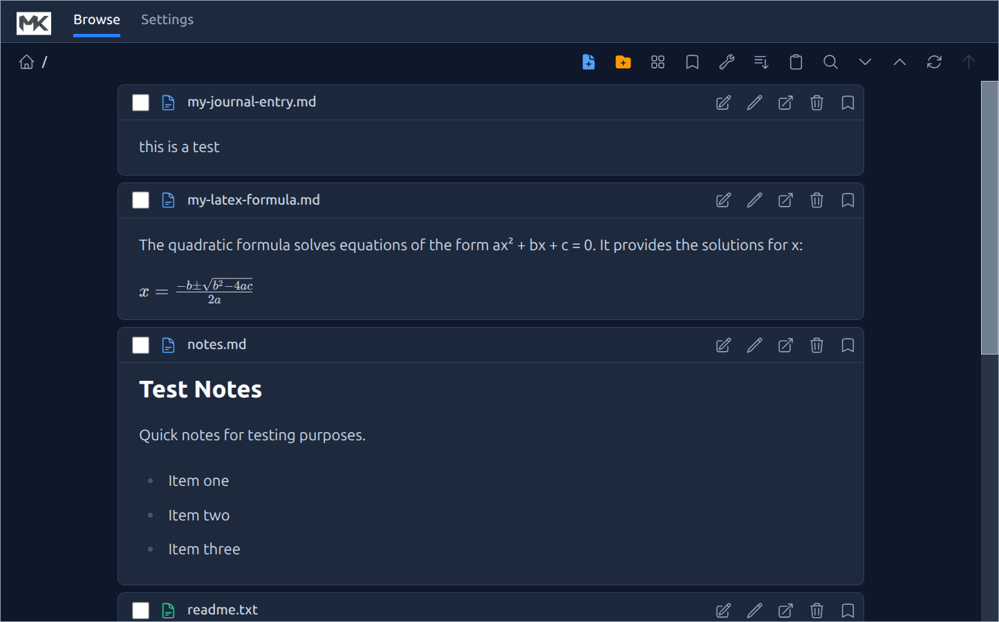

# KoCreator

A video authoring tool that converts a directory of screenshots and narration files into demo videos. Point it at a folder of numbered `.png` images and `.txt` narration scripts and it produces both an **MP4** (with AI-generated voice narration) and an **animated GIF**.

Text-to-speech is powered by [Kokoro TTS](https://github.com/hexgrad/kokoro) (hexgrad, Apache 2.0), which runs entirely offline on your local CPU after initial setup.

## Demo Output

The videos below were generated by the `test-generate.sh` script from the test screenshots and narration files in `test/screenshots/create-mermaid-demo/`.

### Animated GIF



### MP4 Video (with narration audio)

[create-mermaid-demo.mp4](test/test-videos/create-mermaid-demo.mp4)

## How It Works

Create a folder of interleaved screenshots and narration files, ordered by numeric prefix:

```
screenshots/my-demo/
  001-welcome.png
  002-narration.txt          ← converted to speech via Kokoro TTS
  003-next-screen.png
  004-explanation.mp3        ← or use pre-recorded audio (.mp3 / .wav)
  005-final.png
```

- **`.png`** — displayed as a still frame for 2 seconds (configurable)
- **`.txt`** — converted to WAV audio via Kokoro TTS; the most recent screenshot is held on screen for the duration of the narration
- **`.mp3` / `.wav`** — used directly as audio; the most recent screenshot is held on screen

Files are processed in filename order. The first file must always be a `.png` screenshot.

Generated TTS audio is cached in a `generated-wav/` subfolder next to the source files and reused on subsequent runs unless the `.txt` source has changed.

## Setup

Run the one-time setup script to create a Python virtual environment, install dependencies, and download the Kokoro TTS model:

```bash
chmod +x setup.sh
./setup.sh
```

This requires internet access to download the Kokoro model (~327 MB) and voice files from HuggingFace. These are cached locally in `~/.cache/huggingface/` and only downloaded once.

**System requirements:** Ubuntu Linux, Python 3.10–3.12, ffmpeg.

## Usage

```bash
source .venv/bin/activate
python create-video.py <base-folder> <subfolder-name>
```

The script looks for media files in `<base-folder>/screenshots/<subfolder-name>/` and writes output to `<base-folder>/test-videos/`:

- `<subfolder-name>.mp4` — full video with audio narration
- `<subfolder-name>.gif` — animated GIF of the screenshots (no audio)

## Test Data

The `test/` directory contains a built-in demo (`create-mermaid-demo`) with 9 screenshots and 9 narration scripts. Use it to verify your installation or as a reference for structuring your own content.

Run the included test script to generate both video formats from the demo data:

```bash
./test-generate.sh
```

Output will appear in `test/test-videos/`.

## Files

| File | Purpose |
|------|---------|
| `create-video.py` | Main application — builds MP4 and GIF videos from screenshots and narration |
| `kokoro-txt-to-wav.py` | Standalone CLI utility — converts a single text file to a WAV using Kokoro TTS |
| `setup.sh` | One-time setup — creates Python venv, installs kokoro + misaki + ffmpeg deps, runs smoke test |
| `test-generate.sh` | Runs `create-video.py` against the built-in test data in `test/` |

## Phonetic Overrides

Kokoro uses [misaki](https://github.com/hexgrad/misaki) for grapheme-to-phoneme conversion, which supports inline pronunciation overrides in your narration text:

```
[LaTeX](/lˈeɪtɛk/) renders mathematical formulas.
[Kokoro](/kˈOkəɹO/) is an open-weight TTS model.
```

Phoneme reference: https://github.com/hexgrad/misaki/blob/main/EN_PHONES.md

## Offline Mode

Both `create-video.py` and `kokoro-txt-to-wav.py` set `HF_HUB_OFFLINE=1` so they **never contact the internet** during normal use. The TTS model runs entirely on your local CPU. Only `setup.sh` requires internet access (on first run) to download model weights.
