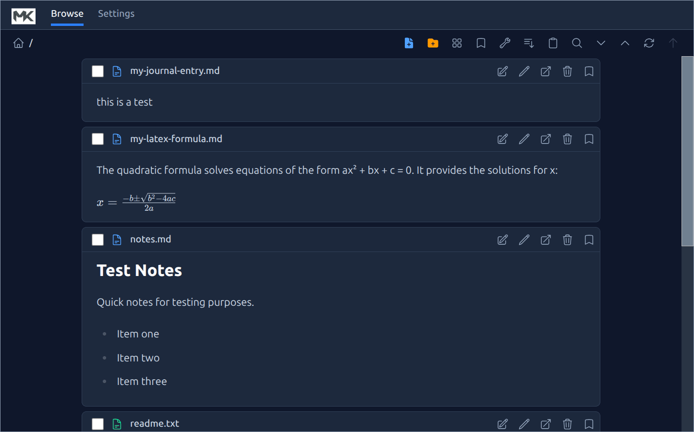

# KoCreator

A video authoring tool that converts a directory of screenshots and narration (text files) into demo videos. Point it at a folder of numbered `.png` images and `.txt` narration scripts and it produces both an **MP4** (with AI-generated voice narration) and an **animated GIF**.

Text-to-speech is powered by [Kokoro TTS](https://github.com/hexgrad/kokoro) (hexgrad, Apache 2.0), which runs entirely offline on your local CPU/GPU after initial setup.

## Demo Output

All of these [MkBrowser Demo Videos](https://clay-ferguson.github.io/videos) were generated by KoCreator, from screenshots and narration files. The MkBrowser screenshots that were used to generate those videos all originated from running Playwright tests, and letting Playwright output those screenshots. However, of course as far as KoCreator is concerned it doesn't know where the screenshots came from, it just makes videos out of the screenshots and narration files.  

The animated GIF and MP4 below were also generated by the `test-generate.sh` script from the test screenshots and narration files in `test/screenshots/create-mermaid-demo/`.

### Animated GIF

Example GIF created by KoCreator



### MP4 Video (with narration audio)

[Example MP4 Generated by KoCreator](https://clay-ferguson.github.io/videos/create-mermaid)

## How It Works

Create a folder of interleaved screenshots and narration files, ordered by numeric prefix:

```
screenshots/my-demo/
  001-welcome.png
  002-narration.txt          ← converted to speech via Kokoro TTS
  003-next-screen.png
  004-explanation.mp3        ← or use pre-recorded audio (.mp3 / .wav)
  005-final.png
```

- **`.png`** — displayed as a still frame for 2 seconds (configurable)
- **`.txt`** — converted to WAV audio via Kokoro TTS; the most recent screenshot is held on screen for the duration of the narration
- **`.mp3` / `.wav`** — used directly as audio; the most recent screenshot is held on screen

Files are processed in filename order. The first file must always be a `.png` screenshot.

Generated TTS audio is cached in a `generated-wav/` subfolder next to the source files and reused on subsequent runs unless the `.txt` source has changed.

## Splashscreen / Intro

You can prepend a shared intro (e.g. a branded splash screen) to every MP4 you produce without copying files into each demo folder. Place the intro assets in a folder named `intro/` **alongside** your demo folders:

```
screenshots/
  intro/                     ← shared intro assets (sibling of your demo folders)
    000-splash.png
    001-splash-narration.txt
  my-demo/
    001-welcome.png
    002-narration.txt
    ...
```

When `create-video.py` runs, it automatically detects the `intro/` sibling folder and prepends its files — sorted by filename — to the beginning of the MP4. The intro files are kept entirely separate from the main demo files during sorting, so there is no risk of interleaving: all intro files come first (in their own order), followed by all demo files (in their own order).

A few details:

- **MP4 only** — intro files are included in the MP4 but are **not** added to the animated GIF.
- **Same file types** — the intro folder supports the same `.png`, `.txt`, `.mp3`, and `.wav` files as a normal demo folder.
- **TTS caching** — narration `.txt` files in `intro/` are converted to speech and cached in `intro/generated-wav/`, independent of the main demo's cache.
- **First file rule** — the first file across intro + demo must still be a `.png` (which it will be naturally if your intro starts with a splash image).
- **Skip the intro** — pass `--no-intro` to omit the intro folder for a single run:

```bash
python create-video.py <base-folder> <subfolder-name> --no-intro
```

## Setup

Run the one-time setup script to create a Python virtual environment, install dependencies, and download the Kokoro TTS model:

```bash
chmod +x setup.sh
./setup.sh
```

This requires internet access to download the Kokoro model (~327 MB) and voice files from HuggingFace. These are cached locally in `~/.cache/huggingface/` and only downloaded once.

**System requirements:** Ubuntu Linux, Python 3.10–3.12, ffmpeg.

### Dependencies

Python dependencies live in `requirements.txt`, which pins the project's **direct**
dependencies to the versions it has been verified against, so a fresh `./setup.sh`
reproduces a known-good environment. Transitive packages (`transformers`, `spacy`,
`tokenizers`, and the `nvidia-*` / `cuda-*` CUDA runtime wheels) are left for pip to
resolve, since `torch` and `kokoro` constrain them themselves.

One entry is worth calling out: `en_core_web_sm`, the spaCy English pipeline that
misaki's grapheme-to-phoneme stage needs. It is not published to PyPI, so it is
referenced by its official release URL. Without that line, misaki calls
`spacy.cli.download()` the first time it runs, which quietly breaks the "no internet
after setup" guarantee on a fresh machine.

### Upgrading Dependencies

To move to newer releases:

```bash
source .venv/bin/activate
pip install --upgrade kokoro "misaki[en]" soundfile numpy torch
pip check              # confirm the resolved set is self-consistent
./test-generate.sh     # confirm TTS and video output still work
```

Then update the pins in `requirements.txt` to match what `pip freeze` now reports for
those packages.

Two things keep this from being a plain "upgrade everything":

- **Python must stay below 3.13.** Both `kokoro` and `misaki` declare
  `requires-python = ">=3.10,<3.13"`, which is why `setup.sh` searches for 3.12/3.11/3.10
  and refuses to build the venv on 3.13+.
- **Leave the `nvidia-*` / `cuda-*` wheels to `torch`.** PyTorch pins them exactly
  (e.g. `nvidia-cudnn-cu13==9.20.0.48`), so upgrading them on their own breaks the
  install. If a `torch` upgrade crosses a CUDA major version, do **not** `pip uninstall`
  the now-orphaned older-CUDA wheels: both generations write to some of the same paths
  under `site-packages/nvidia/`, so removing the old package deletes shared-library files
  the new one is actually using, and `import torch` then fails with
  `ImportError: libcudnn.so.9: cannot open shared object file`. Repair it with
  `pip install --force-reinstall --no-deps nvidia-cudnn-cu13 nvidia-nccl-cu13 ...`.

A few transitive packages are also held back by upper bounds and cannot go to their
newest releases: `thinc` (spaCy 3.8 requires `<8.4.0`), `tokenizers` (transformers
requires `<=0.23.0`), and `mpmath` (sympy requires `<1.4`).

Last verified (2026-08-18) on Python 3.12 with kokoro 0.9.4, misaki 0.9.4,
soundfile 0.14.0, torch 2.13.0, transformers 5.15.0, spacy 3.8.15, and numpy 2.5.2.

## Usage

```bash
source .venv/bin/activate
python create-video.py <base-folder> <subfolder-name>
```

The script looks for media files in `<base-folder>/screenshots/<subfolder-name>/` and writes output to `<base-folder>/test-videos/`:

- `<subfolder-name>.mp4` — full video with audio narration
- `<subfolder-name>.gif` — animated GIF of the screenshots (no audio)

## Test Data

The `test/` directory contains a built-in demo (`create-mermaid-demo`) with 9 screenshots and 9 narration scripts. Use it to verify your installation or as a reference for structuring your own content.

Run the included test script to generate both video formats from the demo data:

```bash
./test-generate.sh
```

Output will appear in `test/test-videos/`.

## Files

| File | Purpose |
|------|---------|
| `create-video.py` | Main application — builds MP4 and GIF videos from screenshots and narration |
| `kokoro-txt-to-wav.py` | Standalone CLI utility — converts a single text file to a WAV using Kokoro TTS |
| `requirements.txt` | Pinned direct Python dependencies — installed by `setup.sh` |
| `setup.sh` | One-time setup — creates Python venv, installs kokoro + misaki + ffmpeg deps, runs smoke test |
| `test-generate.sh` | Runs `create-video.py` against the built-in test data in `test/` |

## Phonetic Overrides

Kokoro uses [misaki](https://github.com/hexgrad/misaki) for grapheme-to-phoneme conversion, which supports inline pronunciation overrides in your narration text:

```
[LaTeX](/lˈeɪtɛk/) renders mathematical formulas.
[Kokoro](/kˈOkəɹO/) is an open-weight TTS model.
```

Phoneme reference: https://github.com/hexgrad/misaki/blob/main/EN_PHONES.md

## Offline Mode

Both `create-video.py` and `kokoro-txt-to-wav.py` set `HF_HUB_OFFLINE=1` so they **never contact the internet** during normal use. The TTS model runs entirely on your local CPU. Only `setup.sh` requires internet access (on first run) to download model weights.
